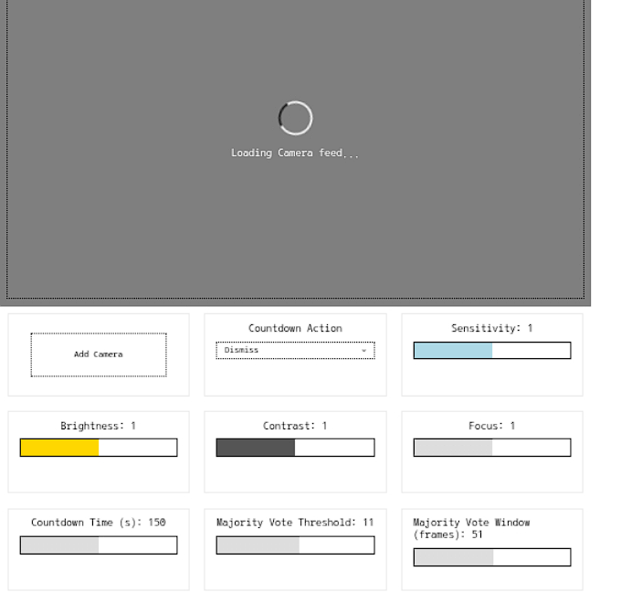
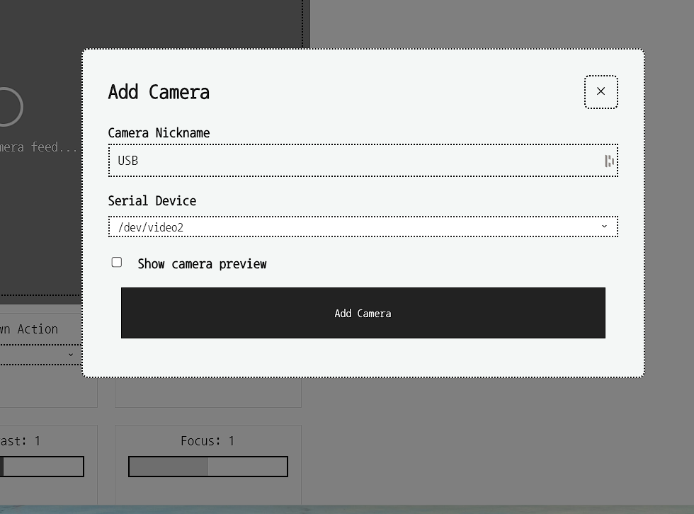
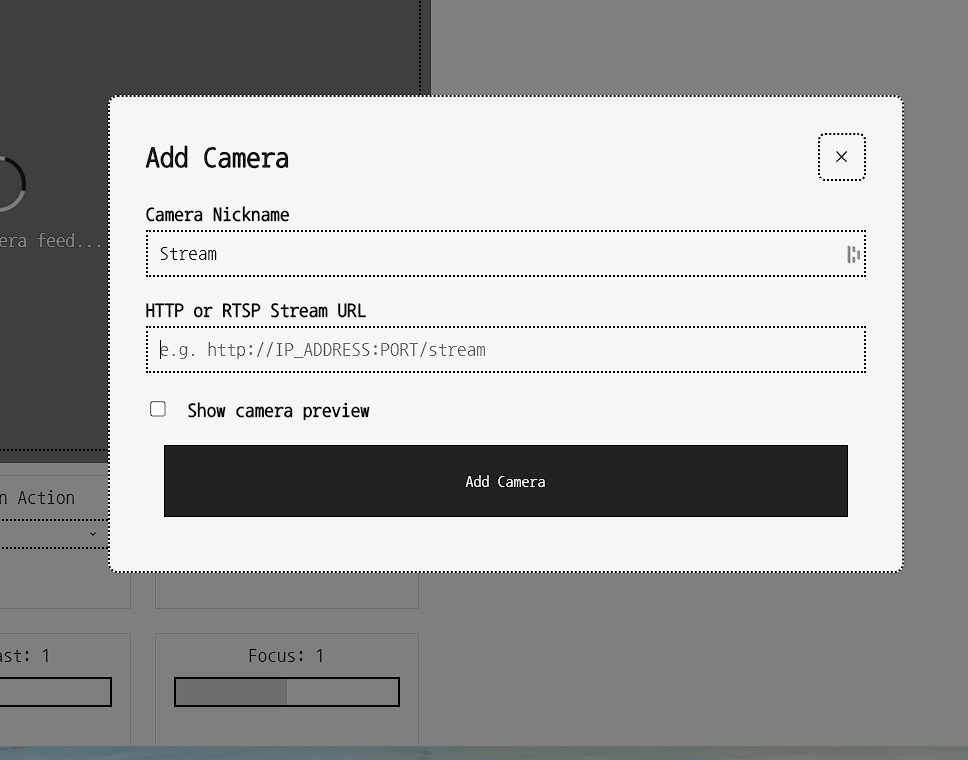
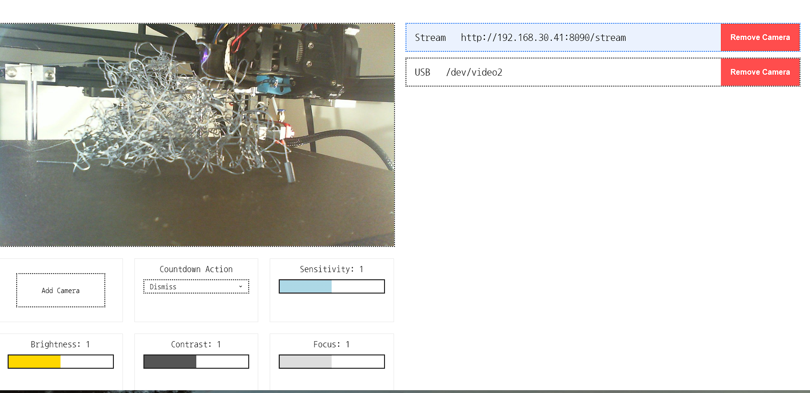
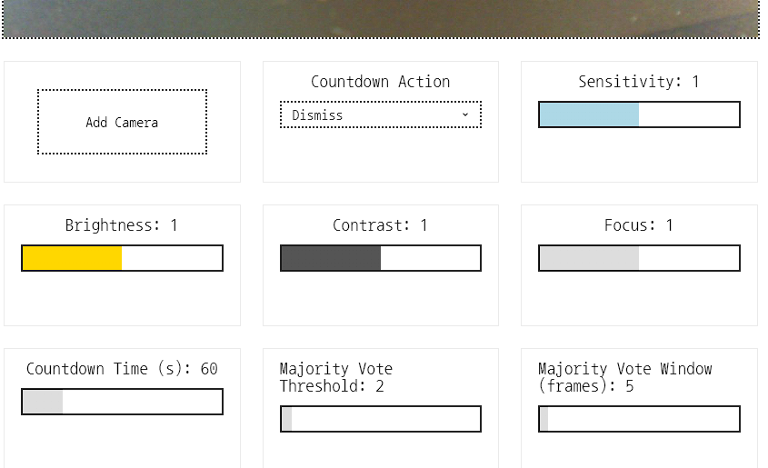
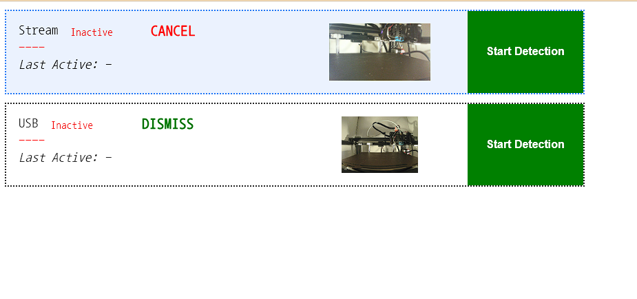
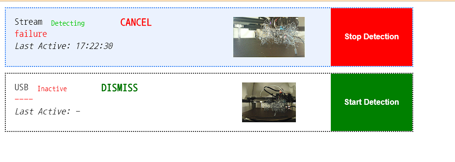
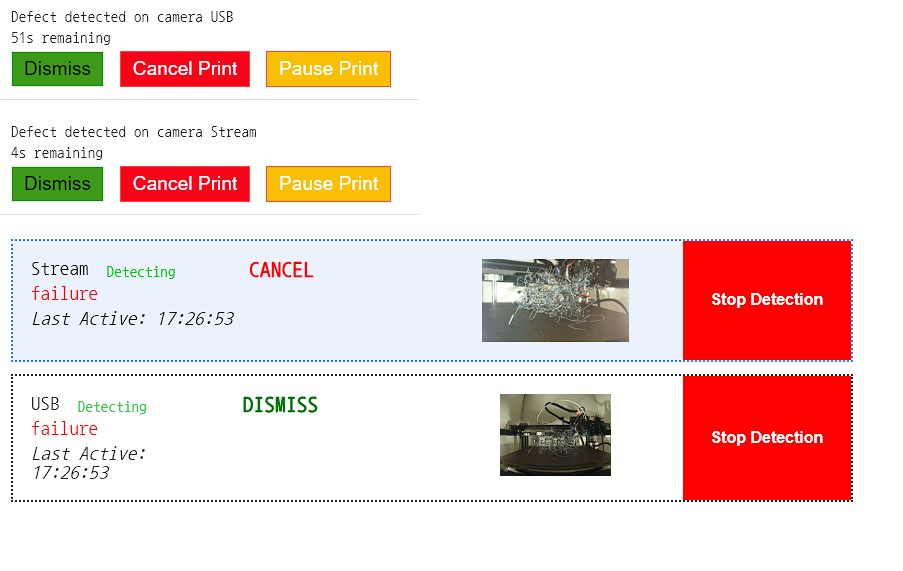

## Table of Contents
- [Features](#features)
- [Installation](#installation)
- [Configuration](#configuration)
- [Logging](#logging)
- [Camera Setup](#camera-setup)
- [Monitoring](#monitoring)
- [Notifications](#notifications)


## Installation
duetPrintGuard is packaged as a DWC plugin and installed in the normal manner from the zip file.

## Configuration

```
# Configuration parameters for duetPrintGuard
# Optional parameters can be commented out with ;
# In which case, defaults will be used as appropriate
# parameter values should not be quoted

[DUET]
# These settings are for the actual printer
# They are the same as would be used for DWC

# IP address of duet printer
# Mandatory e.g. DUETIP = 192.168.1.2
IP =

# DUETPORT address of duet printer
# Optional - only use port has been changed in /opt/dsf/conf/http.json
# Default is 80
;PORT =

# Password for duet
# Optional - only use if password has been set in DWC configuration
;PASSWORD = 

[UI]
# Settings for UI components
# Accessed at either http://localhost or http://<DUETIP>
# PORT cannot conflict with other apps / plugins / or DWC
# Mandatory e.g. PORT = 8001
PORT = 8001

[LOGGING]
# Sets the logging detail
# Valid entries [WARNING,INFO,DEBUG]
# Optional
#Default is INFO
;LEVEL = DEBUG

[ACTION]
# Duet3D commands to be executed when a failure occurs
# All parameters in this section are optional

# PAUSE specifies the pause action
# Optional
# Default - sends M25 to the printer
;PAUSE = 


# CANCEL specifies the cancel action
# Optional
# Default - sends M2 to the printer
;CANCEL = 

 
[MACRO]
# Optional Macro to be called on failure
# This is to facilitate a custom macro eg using MQTT
# tO ACTIVATE 
# Enter string in M98 P"<string>"
# Mandatory if MACRO to be called  e.g. 0:/macros/Notify.g
;MACRO =


[NTFY]
# Optional NTFY service to be called on failure
# To activate requires TOPIC key

# The topic in ntfy that you subscribe to
# Mandatory if NTFY is to be used
;TOPIC =

# The title of the message
# Optional
# Default is system message
;TITLE

# The message to be sent to the ntfy topic
# Optional
# Default is system message if topic is  set
;MESSAGE


[PUSHOVER]
# Optional PUSHOVER service to be called on failure
# To activate requires both API and USER keys

# Application / API token
# Mandatory if PUSHOVER is to be used
;API =

# User / Group Key for PUSHOVER
# Mandatory if PUSHOVER is to be used
;USER = 

# The title of the PUSHOVER message
# Optional
# Default is system message
;TITLE =

# The message to be sent to PUSHOVER
# Optional
# Default is system message if topic is  set
;MESSAGE = 

```

## Logging

## Camera Setup

The camera settings page is accessible via `http://localhost:<PORT>/settings`

 |  | 
  
  It allows you to configure the action to be taken on failure [Dismiss, Pause, Cancel] as well as camera settings, including camera brightness and contrast, detection thresholds, etc |

   | 
  
  Description|

   |  | HTTP or RTS|

   |  | 
  
  bla bla |

   |  | 
  
Change camera parameters |

## Monitoring


 |  | The main interface of PrintGuard. All cameras are shown as a list. Details for each camera are:
 -- The Camera nickname
 -- Current detection status [Detecting, Inactive]
 -- Current print state [Success, Failure] (If Detecting)
 -- The time detection was last Active
 -- The action associated with the camera if a failure exceeds the failure threshold
 -- A thumbnail image of the cameras view
 -- A button to toggle between Detecting and Inactive
 
 If a failure exceeds the threshold - a popup will appear which allows the user to manually override the specified action.  If there is no manual override within the configured countdown time -- the specified action will be taken automatically. |
 

  | | 


  Displays in DWC or separately in a browser http://localhost:<PORT>/duetindex
  
| 
  When a failure is detected an alert modal appears showing a snapshot of the failure and buttons to dismiss the alert or pause or cancel the print job. If the alert is not addressed within the customisable countdown time, the printer will automatically be dismissed, paused or cancelled based on user settings. |

  ## Notifications
  